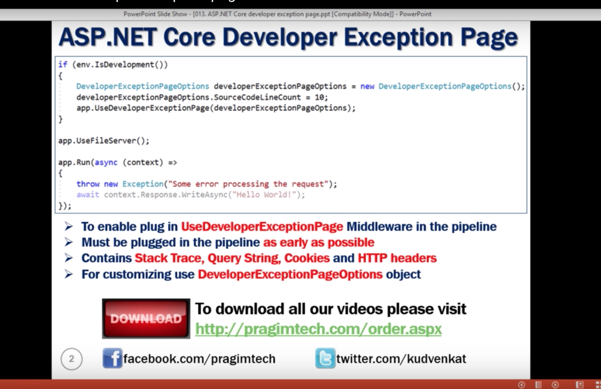

## DeveloperExceptionPage()

In this tutorial I worked on developers exeception page where I called a non existing web page and throwed an exception on server 
-------------------------------------
public void Configure(IApplicationBuilder app, IHostingEnvironment env )
        {
            if (env.IsDevelopment())
            {
                app.UseDeveloperExceptionPage();
            }
//This is the connection which acts as middlware

app.UseFileServer();
           

            app.Run(async (context) =>
            {
                throw new Exption("Some Error request");
                await context.Response.WriteAsync("Hello loli");
            });
---------------------------------------------

## SourceCodeLineObject

By using this we can chose how many lines above the execption statement to see.
It can be created by using DeveloperExceptionPageOptions object and assigning the line count in it.

public void Configure(IApplicationBuilder app, IHostingEnvironment env )
        {
            if (env.IsDevelopment())
            {
                DeveloperExceptionPageOptions developerExceptionPageOptions = new DeveloperExceptionPageOptions
                {
                    SourceCodeLineCount = 10
                };
                app.UseDeveloperExceptionPage(developerExceptionPageOptions);
            }
//This is the connection which acts as middlware

app.UseFileServer();
           

            app.Run(async (context) =>
            {
                throw new Exception("Some Error request");
                await context.Response.WriteAsync("Hello loli");
            });
        }

---------------------------------------------

  