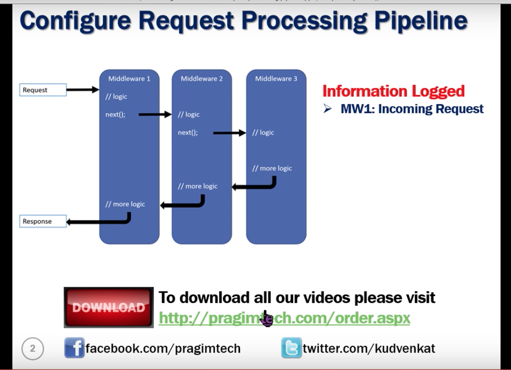

# ASP.NET-2.2--Catching-up-with-KudVenkat
This repo consists of CRUD operation in .NET 2.2 by kudvenkat.

//In startup.cs
//This is the connection which acts as middlware
            app.Run(async (context) =>
            {
                await context.Response.WriteAsync("Hello from first middleware");
            });
                Some print stamement after this is not served.
This is the terminal middleware where it will not pass from this stage to other line. It will take the request and responds back.

If we want to add another middleware - use 'Use method' which takes two parameters (context, next)

        app.Use(async (context, next) => 
            {
                await context.Response.WriteAsync("Hello from first middleware");
                await next();
            });

            app.Run(async (context) =>
            {
                await context.Response.WriteAsync("Hello from second middleware");
            });

-------------------------------------------------------

ILogger.
public void Configure(IApplicationBuilder app, IHostingEnvironment env, ILogger<Startup> logger)

         app.Use(async (context, next) =>
            {
                //await context.Response.WriteAsync("Hello from first middleware");
                logger.LogInformation("MW1: incomming request");
                await next();
                logger.LogInformation("MW1: outgoing response");
            });

//
 app.Use(async (context, next) =>
            {
                //await context.Response.WriteAsync("Hello from first middleware");
                logger.LogInformation("MW2: incomming request");
                await next();
                logger.LogInformation("MW2: outgoing response");
            });

            

            app.Run(async (context) =>
            {
                await context.Response.WriteAsync("MW3: response is handled and produced");
                  logger.LogInformation("MW3: Request Handled");
            });
            
            
            
  
