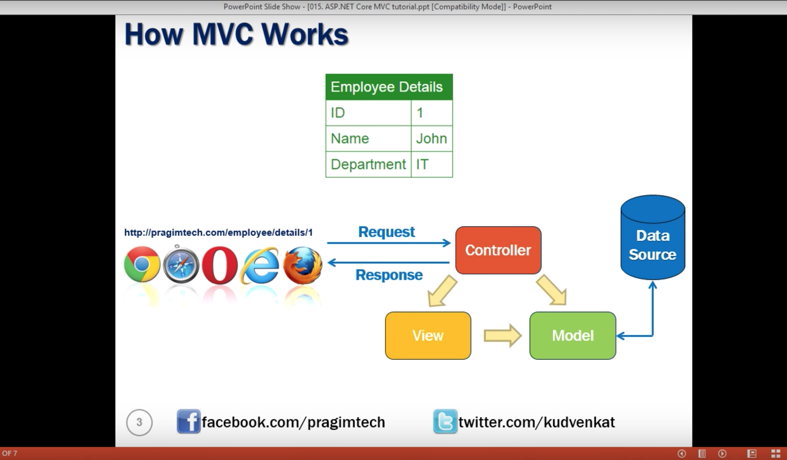

## MVC ARCHITECTURE

  

 ## MODEL:

  

 ## View:

 Model has the data but doest know how to present the data. This model object is provided to the view by controller.
  

 ## Controller:

 When a request from browser arrives at our application, controller handles it

 

## Summary

 
