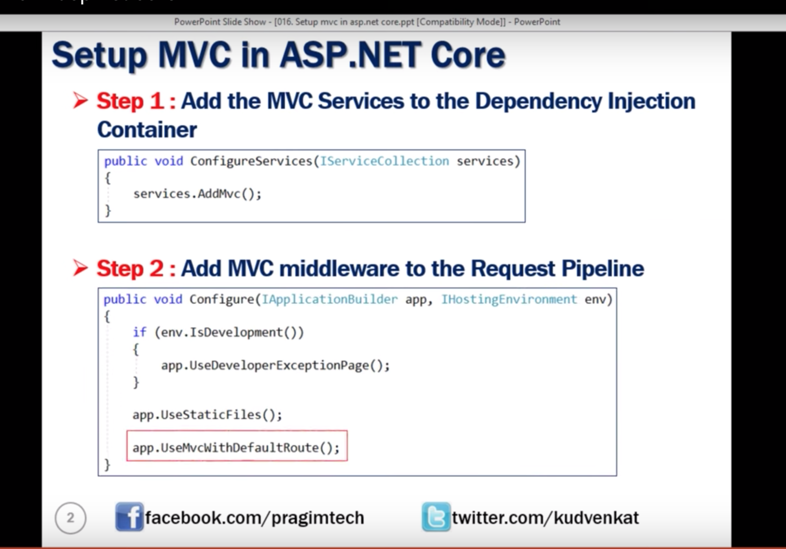

## Adding MVC to your app
In configure services method add services.mvc()
 public void ConfigureServices(IServiceCollection services)
        {
            services.AddMvc();
        }

These two lines are added. When the execution reaches app.UseMvcWithDefaultRoute() it looks for the home controller which is placed in controllers folder is executed. Look for the documentation.

 app.UseStaticFiles();
 app.UseMvcWithDefaultRoute();

If we call someother controller which is not present. It will execute from this ap.run

app.Run(async (context) =>
            {
                //throw new Exception("Some Error request");
                await context.Response.WriteAsync("Hello loli");
            });
-----------------
## In a NutShell
  