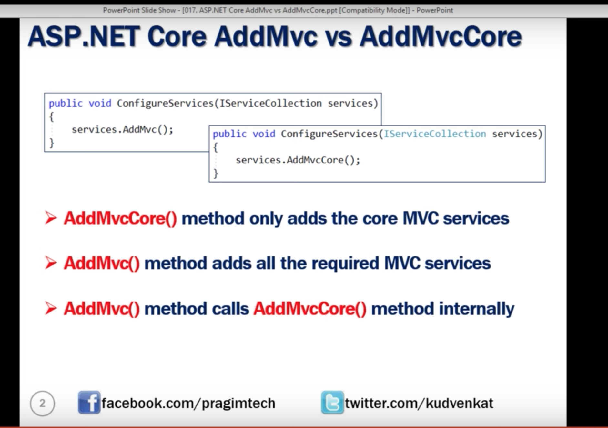

## Adding MVC to your app
In configure services method add services.mvc()
 public void ConfigureServices(IServiceCollection services)
        {
            services.AddMvc();
        }

These two lines are added. When the execution reaches app.UseMvcWithDefaultRoute() it looks for the home controller which is placed in controllers folder is executed. Look for the documentation.

 app.UseStaticFiles();
 app.UseMvcWithDefaultRoute();

If we call someother controller which is not present. It will execute from this ap.run

app.Run(async (context) =>
            {
                //throw new Exception("Some Error request");
                await context.Response.WriteAsync("Hello loli");
            });
------------------
## Difference Btwn services.AddMvc(); and services.AddMvcCore();
If we want our Index method from controller class to return anything. We have to inherit the Controller class to Homecontroller class from 
using Microsoft.AspNetCore.Mvc.  So we can return JSON data or html or views etc.

namespace MVC.Controllers
{
    public class HomeController: Controller
    {
        public JsonResult index(){
            return Json(new{id=1, name="Loli"});
        }
    }
}

This returns the JSON data.
 

-----------------
## In a NutShell
  