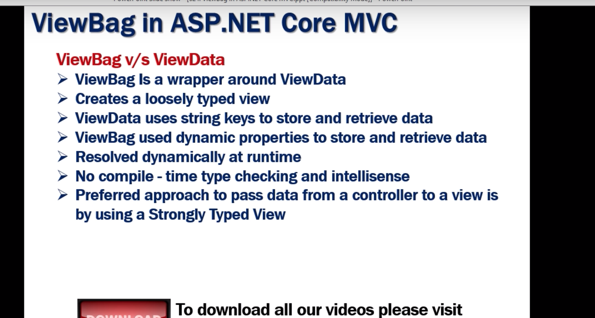

## Viewdata
Dictonary of weakly typed objects.

## ViewBag

We have to create theproperty with Viewbag tag.

        public ViewResult Details(){
            Employee model = _employeeRepository.GetEmployee(1);
            ViewBag.Employee = model;
            ViewBag.PageTitle = "Page Title";
            return View();
        }
## To represent it in the .cshtml page we have to call the property by using viewbag method

 <body>
        <h3>@ViewBag.PageTitle </h3>
    </body>

## WITH VIEWDATA WE USE STRING KEY ENTITY DATA WHERE AS WITH VIEW BAG WE USE DYNAMIC PROPS.

 
